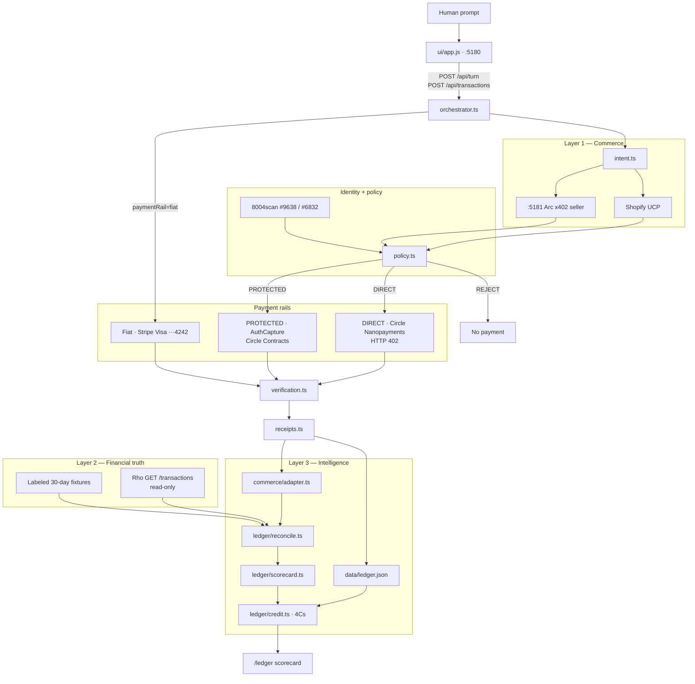

# AgentLedger

Financial observability for autonomous commerce agents. Built for **LOCK IN Hack** (Rho, Sep 12–13 2026) — Best Use of the Rho API.

Commerce platforms report what was sold. Rho reports what actually settled. AgentLedger joins the two feeds per agent and answers: **which agent should I trust with more money?**

Today every agent payment is prepaid. Rho turns observed cash into a 4C credit file — character, capacity, collateral, condition — so a credit line can exist tomorrow.

## Links

| | |
|---|---|
| **Repo** | [github.com/dhru7777/Rho-AgentLedger](https://github.com/dhru7777/Rho-AgentLedger) |
| **Live demo** | [web-production-eeef3.up.railway.app](https://web-production-eeef3.up.railway.app) |
| **Live scorecard** | [web-production-eeef3.up.railway.app/ledger](https://web-production-eeef3.up.railway.app/ledger) |
| **Live architecture** | [web-production-eeef3.up.railway.app/architecture](https://web-production-eeef3.up.railway.app/architecture) |
| **4Cs presentation (Canva)** | [canva.link/zc8k9kynpnxexvi](https://canva.link/zc8k9kynpnxexvi) |
| **Local demo** | [http://127.0.0.1:5180](http://127.0.0.1:5180) |
| **Local scorecard** | [http://127.0.0.1:5180/ledger](http://127.0.0.1:5180/ledger) |
| **Local architecture** | [http://127.0.0.1:5180/architecture](http://127.0.0.1:5180/architecture) |
| **Commerce rails (AgentARC)** | [github.com/ysbobde2002/AgentARC](https://github.com/ysbobde2002/AgentARC) |
| **AgentARC live demo** | [agentarc-production.up.railway.app](https://agentarc-production.up.railway.app) |
| **AgentARC architecture** | [agentarc-production.up.railway.app/architecture](https://agentarc-production.up.railway.app/architecture) |
| **Buyer identity (ERC-8004)** | [testnet.8004scan.io · #9638](https://testnet.8004scan.io) |
| **Seller identity (ERC-8004)** | [testnet.8004scan.io · #6832](https://testnet.8004scan.io) |
| **Arc explorer** | [testnet.arcscan.app](https://testnet.arcscan.app) |
| **Circle faucet (Arc USDC)** | [faucet.circle.com](https://faucet.circle.com) |

The buyer/seller UI and payment rails are copied from AgentARC (Circle Agent Wallets, x402 nanopayments, AuthCapture). Layers 2–3 — Rho settlements and the 4C scorecard — are new.

---

## What we are building

A CFO console for agents that already buy and sell on their own.

1. A **buyer agent** spends on a spend cap: Shopify UCP commerce (chocolates) or an Arc x402 seller (ETH spot, OHLC, research memo).
2. Payment can go **crypto** (Circle USDC on Arc) or **fiat** (Stripe test Visa ···4242).
3. Every successful payment becomes a commerce **order** and a Rho **settlement**.
4. AgentLedger joins those feeds and scores each agent on the **4Cs of credit**.

The hackathon slice is one buyer, one seller, dual rails, a 30-day Rho cohort, and a live scorecard. Rho is **read-only** — `accounts:read` and `transactions:read`. No transfer authority.

---

## The problem

Businesses can see what they spent and what their store sold. Once AI agents act on their behalf, they cannot answer a more basic question: **which agent is creating economic value, and which one should get more budget?**

The 4Cs already exist as a protocol story — identity, merchant rails, cashbacks, micropayments. None of that is a credit file. A bank underwrites character, condition, collateral, and capacity from cash that actually settled. Without that feed, every agent stays prepaid.

| Gap | What you see today | What is missing |
|---|---|---|
| Storefront claims | Shopify / x402 “sale” | Independent proof the money settled |
| Cost of autonomy | Revenue on the order feed | M2M spend (x402, enrichment APIs) that never hits a storefront |
| Agent attribution | One company wallet | Which agent caused the cash movement |
| Underwriting | A single checkout screenshot | A 30-day file: ROI, match rate, dual-rail history |

That is one problem, not two. Observability (order ↔ settlement) is how you compute the 4Cs honestly. The 4Cs are how you decide who gets more money.

---

## What we use to solve it

| Layer | Job | What we actually call |
|---|---|---|
| **Commerce** | What was sold | Shopify Universal Commerce Protocol; local Arc x402 seller (`cli/seller.ts` on :5181) |
| **Identity** | Who is acting | ERC-8004 on Sepolia via [8004scan](https://testnet.8004scan.io) — buyer `#9638`, seller `#6832` |
| **Policy** | Whether to pay | `src/policy.ts` — fail closed on missing identity, overspend, ≥3 seller failures |
| **Crypto rail** | How crypto settles | Circle Agent Wallets, Nanopayments (HTTP 402 + Gateway), AuthCapture escrow on Arc Testnet (`eip155:5042002`) |
| **Fiat rail** | How fiat settles | Stripe PaymentIntents, test Visa `pm_card_visa` ···4242 |
| **Financial truth** | What actually settled | Rho `GET /transactions` (`src/rho`). Live when `RHO_API_TOKEN` is set; otherwise a labeled 30-day fixture cohort |
| **Intelligence** | Who to trust | Join + 4C scorecard (`src/ledger`) |

Swapping the storefront (Stan, WooCommerce, Stripe Checkout) must never touch Rho or the scorecard. Orders leave commerce as a generic `{ id, agentId, amountCents, reference }`.

---

## How Rho helps

Rho is the load-bearing layer. The top row of the Canva board is how agents **transact**. The question marks under each C are how a treasury **underwrites** them. Rho fills that bottom row.

| C | Protocol (already on the Canva) | Rho (under the `?`) |
|---|---|---|
| **Character** | ERC-8004 identity registry | Settled vs claimed behavior: match rate and fail/success on the bank feed. A badge with no cash history stays prepaid-only. |
| **Condition** | UCP merchants, MCC, guardrails, merchant rail | Treasury condition: counterparty, category, dual-rail (Stripe + Circle), order↔settlement join. Merchant self-report is not an MCC. |
| **Collateral** | Cashbacks / bidding amount | Prepaid float that actually moved. Rho sees Visa and USDC as cash, not a cashback promise. |
| **Capacity** | Micropayments, x402 earning | Cost side of P&L. Commerce shows revenue; Rho shows what the agent spent, including M2M that never hits a storefront. |

What Rho uniquely carries:

- **Ground truth over claims** — settled money movement, not a storefront’s self-reported sale. That is what makes ROI verifiable.
- **The cost side** — commerce platforms show revenue; Rho is the source for autonomous spend.
- **The reconciliation spine** — every order-to-settlement match, every agent P&L, and every 4C score is a join against Rho’s transaction feed.
- **The underwriting window** — 30+ days of `id`, timestamp, amount, currency, counterparty, memo — not a single checkout.

Rho has no native “agent” field. Attribution is injected as `agent:sales|support|research` (and `order:…`) on memo/note, or inferred by amount + timestamp within 48 hours (`src/ledger/attribution.ts`, `src/ledger/reconcile.ts`).

The scorecard thesis, from `src/ledger/scorecard.ts`:

> Rho turns prepaid agent spend into a 4C credit file: character, capacity, collateral, condition.

Suggested credit line is `4C score × $25`. `prepaidToday` stays `true` — the file is what lets Rho extend credit later.

---

## Low-level architecture

Three layers. Commerce never imports Rho. Rho never imports Shopify. The ledger is the only join.



### Payment loop (Layer 1)

```text
Human prompt
  → parseIntent (service type, asset, spend cap)
  → discover Shopify UCP offer or local Arc catalog
  → ERC-8004 identity + recent failures (fail closed if identity missing)
  → policy: REJECT | DIRECT nanopayment | PROTECTED escrow
  → pay
       DIRECT:     GET seller → HTTP 402 → buyer signs → PAYMENT-SIGNATURE → Gateway / Arc USDC
       PROTECTED:  authorize USDC into operator escrow → deliver → verify → capture or void
       FIAT:       Stripe PaymentIntent on test Visa ···4242
  → independent verify (schema, timestamp, request correlation — not seller-attested)
  → receipt
```

Policy thresholds (`src/policy.ts`):

- Missing ERC-8004 identity → **REJECT**, no payment.
- Price above spend cap → **REJECT**.
- ≥3 recent seller failures → **REJECT**.
- ≤ $1, instant, objective → **DIRECT** nanopayment.
- ≥ $100, lagged, or subjective → **PROTECTED** AuthCapture.

### Ledger join (Layers 2–3)

```text
SUCCESS receipt
  → commerce order (platform-agnostic)
  → mirrored Rho settlement (demo write; live Rho is read-only)
  → row in data/ledger.json (rail: crypto | fiat)

GET /api/ledger/scorecard
  → listOrders() ⋈ listRhoTransactions()
  → match by memo order:…  else amount + ±48h timestamp + agent tag
  → P&L per agent (sales / support / research)
  → 4C file + suggested credit line
```

### Module boundaries

| Boundary | Owner | Contract |
|---|---|---|
| Demo HTTP | `cli/serve.ts` | Buyer UI, orchestrator, health, Rho, ledger. Port **5180**. |
| x402 seller | `cli/seller.ts` · `src/seller/server.ts` | Own process on **5181**. Unpaid `GET /charts/*` is HTTP 402 on `eip155:5042002`. |
| Intent | `src/intent.ts` | Prompt + spend cap → financial-data, research, or commerce. |
| Commerce adapter | `src/commerce/` | Generic orders. Shopify and x402 never leak into Rho. |
| Rho client | `src/rho/` | Live REST and fixtures share one `RhoTransaction` type. `RHO_MODE=auto\|live\|fixture`. |
| Attribution | `src/ledger/attribution.ts` | `agent:sales\|support\|research` on memo/note. |
| Reconcile | `src/ledger/reconcile.ts` | Reference match, then amount + 48h fuzzy, else unmatched. |
| 4C credit | `src/ledger/credit.ts` | Character, capacity, collateral, condition → line = score × $25. |
| Trust | `src/trust.ts` | Live 8004scan. Feedback is not a single score. |
| Policy | `src/policy.ts` | Fail closed. DIRECT vs PROTECTED. |
| Nanopayments | `src/seller/client.ts` · `src/circle/nanopayments.ts` | Buyer signs `PAYMENT-REQUIRED`; seller settles, then serves. |
| Escrow | `src/circle/escrow.ts` · `contracts/AgentJobEscrow.sol` | Authorize → verify → capture or void. |
| Fiat | `src/stripe/` | Test PaymentIntents; webhooks optional. |
| Verification | `src/verification.ts` | Independent checks, not seller-attested. |
| Persistence | `src/db/store.ts` | `data/ledger.json` — crypto and fiat history for the scorecard. |

### Processes

```text
npm start
  ├─ :5180  buyer UI + orchestrator + Rho + scorecard
  └─ :5181  Arc x402 seller (started by cli/serve.ts)
```

---

## Run (no secrets)

```bash
npm install
npm start
```

Open [http://127.0.0.1:5180](http://127.0.0.1:5180). Adapter payment mode and **rho · fixture** are the worst-case path — the join logic is the same when a token arrives.

1. `Find me chocolates under $10` (commerce) or `Get me the current ETH price. Spend up to $0.05` (x402).
2. Pick **Crypto** or **Fiat** on the buyer phone.
3. Receipt lands; **Ledger** tab and [/ledger](http://127.0.0.1:5180/ledger) update the 4C file.

```bash
npm test          # vitest: reconcile, 4C scoring, policy, trust
npm run typecheck
```

---

## Env

Copy `.env.example`. Nothing is required to boot.


## API

| Method | Path | |
|---|---|---|
| `GET` | `/api/health` | Product, rails, payment mode |
| `GET` | `/api/architecture` | LLD JSON consumed by `/architecture` |
| `GET` | `/api/rho/health` | `live` vs `fixture`, token present, count |
| `GET` | `/api/ledger/scorecard` | Agents, 4Cs, matches, suggested lines |
| `GET` | `/api/ledger/transactions` | `data/ledger.json` |
| `POST` | `/api/turn` | Natural-language commerce loop |
| `POST` | `/api/transactions` | Execute purchase (`paymentRail`: `crypto` \| `fiat`) |
| `POST` | `/api/transactions/:id/settle` | Capture or void escrow |

---

## Acknowledgments

Commerce rails from [AgentARC](https://github.com/ysbobde2002/AgentARC). Rho is the settlement spine that turns those rails into a credit file.
